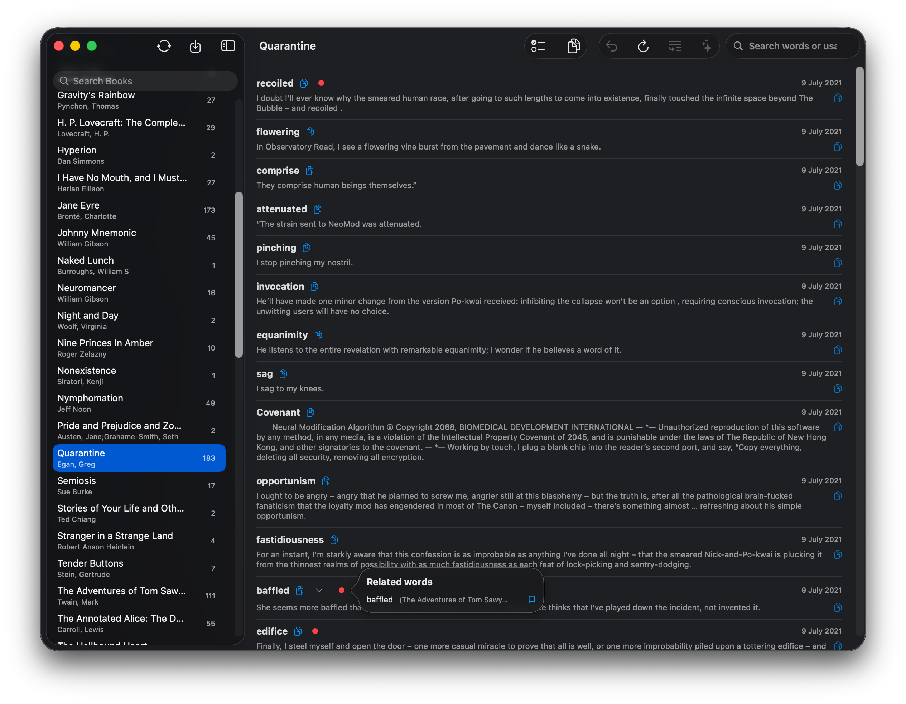

# KindleBro
KindleBro is a minimal, native Apple-silicon macOS application designed to help you manage and master your Kindle vocabulary. It provides an end-to-end workflow, from captured words to ready-to-use flashcards.

The app is targeted primarily at advanced language learners who use SRS systems. Reading fiction is one of the most efficient ways to mine vocabulary.

Inspired by [Kindle Mate](https://sourceforge.net/projects/kmate/). Completely free and opensource.

## Key Features
### 📖 Kindle Integration
- **One-Click Sync**: Seamlessly import your `vocab.db` directly from a connected Kindle device.
- **Library Organization**: Words are aggregated by book. Within each book, words are ordered in reverse chronological order, allowing efficient batch processing as you progress through a book.
### Word Processing
- Newly imported words are set to the `Learning` state. From there, they can be marked as:
    - `Ignored` — for erroneously added words (there is no way to remove words from `vocab.db` on Kindle).
    - `Mastered` — for processed words with created flashcards.
- The goal is to process all words. When all words in a book are set to `Mastered` or `Ignored`, the book is marked as `Completed` and moved to the **Completed** section. This separates in-progress books from finished ones.
- With **Refresh** button, `Completed` and `Ignored` words are moved to the bottom of the list to simplify batch processing in word-dense books.
- Each word includes its usage (the context sentence from the book). Context is critical for retrieval. If a word has multiple usages within the same book, a chevron appears, allowing you to select the preferred usage for subsequent processing.

> [!note]  
> Experiments with flashcards containing multiple usages showed that excessive information in a single card reduces retrieval quality. The app therefore limits each word to one preferred usage.
- When the same word appears in multiple books, its status is shared. Marking a word as `Mastered` updates it across all books.
- **Undo Support**: Revert status changes if needed.
- Each word includes a copy icon for copying the word or its usage separately.
- Multiple words can be selected using the Command key.
- Dedicated buttons for:
    - `Select all Learning words`
    - `Copy all Learning words`
    - `Copy selected words with prompt`
### 🔍 Advanced Search & Discovery
- **Book Title Search**: Quickly filter your book list.
- **Global Search**: Search across the entire vocabulary library, including both words and contexts.
    - Stem-based search for English. For example, “peeved” also finds “peeve,” while usage text is matched literally.
- **Related Words**: Words sharing the same stem across different books are grouped and shown via a red-dot popover, allowing quick navigation. This feature can be disabled in Settings, along with stem-based search.
### Library Management
- `vocab.db` can be imported from any location.
- Multiple `vocab.db` files can be imported into a single library. The import mode is append-only.
- The library can be exported for backup, including word states and the custom prompt.
- The library can be erased.
### AI-Powered Flashcards
- **Dual AI Provider Support**: Use either **OpenAI** or **Google Gemini** to generate study materials. The model list is fetched dynamically to ensure access to recent models.
- **Customizable Prompts**: Define your own prompt structure to generate flashcards exactly as required (e.g., Anki, RemNote, or custom formats).
- **Auto-Mastering**: Optionally mark words as `Mastered` automatically when flashcards are generated or copied with a prompt.
The default prompt targets RemNote as most advanced SRS system:
```
For a given set of words and usage samples, generate RemNote flashcards in the following format:

word>>3 most frequent translations, ordered by descending frequency, with the most frequent translation wrapped in **bold**. After the translations, add a usage sample enclosed in backticks (``). At least one translation must be derived from the provided usage. If a word has fewer than three frequent translations, list only the available ones.  
Each flashcard must be on a new line. Do not add any text, comments, or explanations — output **only** the generated flashcards.

Example:  
test>>**translation1**, translation2, translation3 `Usage example`
```
> [!tip]  
> The exact flashcard format can be customized via prompt engineering.

After testing various free models, `Gemini-3-Flash` currently produces the most reasonable translations. This is expected, as it ranks highly on the [MMMLU](https://llm-stats.com/benchmarks/mmmlu) benchmark.
- **Dedicated AI Output**: View and copy AI-generated content in a specialized, non-intrusive results window.
#### LLM usage for flashcard generation
I was initially opposed to using LLMs for flashcard generation due to the relatively high error rate, and because writing cards manually improves retention.

However, models have improved significantly. Translation hallucinations are now rare, and proper prompt engineering reduces the error rate further. In particular, including usage examples gives the model enough context to choose more accurate translations.

Even assuming occasional errors, LLM output should be compared to traditional dictionary lookup. In practice, LLM-based generation is significantly faster, which can justify a small number of imperfect cards in large batches.

AI usage remains optional and is entirely up to personal preference.
## Install
After installing the `.dmg`, remove the quarantine attribute:
```
xattr -d com.apple.quarantine /Applications/KindleBro.app
```
## Local Build
Run `./package.sh` to compile and create the `.dmg` installer and `.app` executable.
## Suggested Workflow
Assuming initial setup is complete:
- Finish a book.
- Connect your Kindle and sync new words using the **Sync** button.
- Open the finished book and review all words:
    - Mark erroneous or irrelevant words as `Ignored`.
    - Mark known words as `Mastered`.
- Press **Refresh** so that `Mastered` and `Ignored` words move to the bottom.
- Press **Select all Learning words**.
- Generate flashcards using **Generate flashcards**.
- Press **Copy result**.
- Paste the result into your SRS system. With proper prompt engineering, no additional formatting is required.
> [!tip]  
> Up to 100 words per batch is recommended for word-heavy books.

---

_"Turn every book you read into a library of knowledge you'll never forget."_ — Gemini 3 Flash
